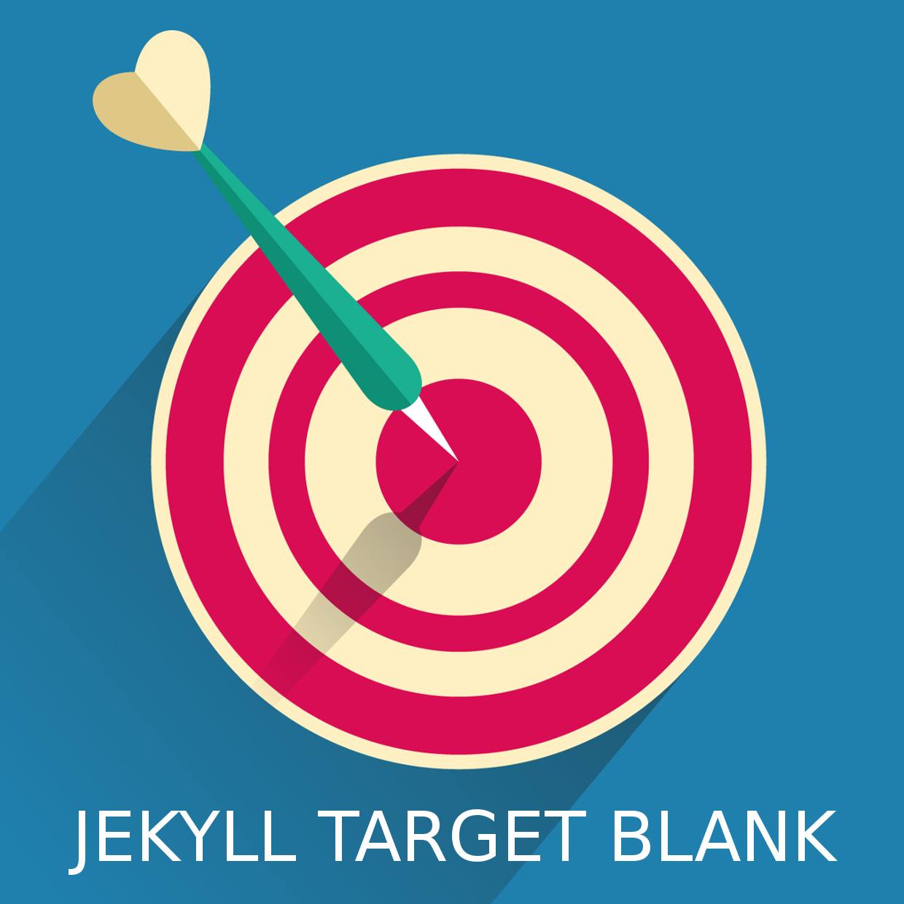

# Jekyll Target Blank



Automatically adds a `target="_blank" rel="noopener noreferrer"` attribute to all __external__ links in Jekyll's content plus several other automation features for the external links. [Read more here](https://keith-mifsud.me/projects/jekyll-target-blank)

[](https://badge.fury.io/rb/jekyll-target-blank)
[](https://travis-ci.org/keithmifsud/jekyll-target-blank)

## Installation

Add the following to your site's `Gemfile`

```
gem 'jekyll-target-blank'
```

and add the following to your site's `_config.yml`

```yml
plugins:
  - jekyll-target-blank
```

Note: if `jekyll --version` is less than `3.5` use:

```yml
gems:
  - jekyll-target-blank
```

## Usage

By default. all anchor tags and markdown links pointing to an external host, other than the one listed as the `url` in Jekyll's `_config.yml` will automatically be opened in a new browser tab once the site is generated.

All the links in pages, posts and custom collections are included except for __plain text links.

### Examples

#### HTML

The following `HTML` anchor tag:

```html
<a href="https://google.com">Google</a>
```

will be replaced with:

```html
<a href="https://google.com" target="_blank" rel="noopener noreferrer">Google</a>
```

..unless your website's URL is google.com 😉

#### Markdown

```markdown
[Google](https://google.com)
```

will be generated as:

```html
<a href="https://google.com" target="_blank" rel="noopener noreferrer">Google</a>
```

### Configuration

No custom configuration is needed for using this plugin, however, you can override some default behaviours and also make use of some extra features as explained in this section. 

#### Override the default behaviour

You can override the default behaviour and only force external links to open in new browser if they have a CSS class name included with the same value as the one listed in the Jekyll `_config.yml` file.

To override this automation, add an entry in your site's `config.yml` file, specifying which CSS class name a link must have for it to be forced to open in a new browser:

```yaml
target-blank:
    css_class: ext-link
```

With the above setting, only links containing the `class="ext-link"` attribute will be forced to open in a new browser.

#### Automatically add additional CSS Classes

You can also automatically add additional CSS classes to qualifying external links. This feature is useful when you want to add CSS styling to external links such as automatically displaying an icon to show the reader that the link will open in a new browser.

You can add one or more __space__ separated CSS classes in `_config.yml` like so:

 ```yaml
 target-blank:
     add_css_classes: css-class-one css-class-two
 ```
 
 The above example will add `class="css-class-one css-class-two"` to the generated anchor tag. These CSS class names will be added in addition to any other existing CSS class names of a link.
 
 #### Override the default rel attributes
 
 For security reasons, `rel="noopener noreferrer"` are added by default to all the processed external links. You can override adding any of the `noopener` and `noreferrer` values with the following entries in your site's `_config.yml` file. 
  
 __To exclude the `noopener` value:__
 
 ```yaml
target-blank:
    noopener: false
```

__To exclude the `noreferrer` value:__
 
 ```yaml
target-blank:
    noreferrer: false
```

__To exclude both `noopner` and `noreferrer` values:__
 
 ```yaml
target-blank:
    noopener: false
    noreferrer: false
```

#### Adding additional rel attribute values

You can add additional `rel=""` attribute values by simply specifying them in your site's `_config.yml` file.

```yaml
target-blank:
    rel: nofollow
```

or even more than one extra:

```yaml
target-blank:
    rel: nofollow
```

__Note:__


The `rel` setting overrides other default `rel` attribute values. Therefore, (for example), if you exclude the `noopener` value and then add it to the `rel` property, it will still be added. The following `config`:

```yaml
target-blank:
    noopener: false
    rel: noopener
```

will output:

```html
<a href"https://some-external-website.what" target="_blank" rel="noreferrer noopener">Some link</a>
```


## Support

Simply [create an issue](https://github.com/keithmifsud/jekyll-target-blank/issues/new) and I will respond as soon as possible.


## Contributing

1. [Fork it](https://github.com/keithmifsud/jekyll-target-blank/fork)
2. Create your feature branch (`git checkout -b my-new-feature)
3. Commit your changes (`git commit -m 'Add some feature'`)
4. Push to the branch (git push origin my-new-feature)
4. Create a new Pull Request


### Testing

```bash
rake spec
# or
rspec
```

## Credits

The logo illustration was <a href="http://www.freepik.com">Designed by Freepik</a>. Thank you ❤️


## Legal

This software is distributed under the [MIT](LICENSE.md) license.

&copy; 2018 - Keith Mifsud <https://keith-mifsud.me> and approved contributors.
